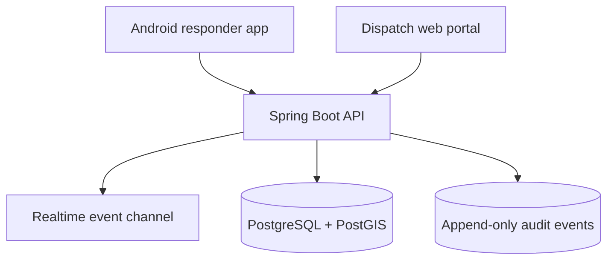

# Platform architecture

## System context

Open911 is a multi-tenant platform. An agency is the primary security and data-isolation boundary. A user may belong to multiple agencies, but every operational request is evaluated within one explicitly selected agency.

## Applications

### Android responder app

- Native Kotlin and Jetpack Compose.
- Bottom navigation: Overview, Incident, Command.
- Local persistence will support a read-only degraded mode and queued, clearly marked outbound actions.
- Google Maps SDK will display incidents, units, hazards, staging, and relevant boundaries.
- Routing launches Google Maps initially; embedded route computation can be added after usage and cost controls are defined.

### Dispatch and administration portal

- React and TypeScript.
- Dispatch workspace prioritizes active incidents, pending calls, unit state, alerts, and mapping.
- Administration covers agencies, departments, stations, personnel, roles, units, equipment, radio channels, status definitions, and retention policy.
- Command functions use the same API and domain rules as mobile command functions.

### Backend

- Kotlin with Spring Boot.
- REST for commands and snapshots; WebSockets for agency and incident event streams.
- PostgreSQL is the system of record. PostGIS supports proximity, jurisdiction, route-adjacent, and geofence queries.
- Every mutation produces an audit event in the same transaction.
- External integrations are adapters, not domain dependencies.

## Module boundaries

| Module | Responsibility |
| --- | --- |
| Identity | Users, agency memberships, roles, devices, sessions |
| Configuration | Departments, stations, status definitions, radio plans |
| Resources | Responders, units/apparatus, equipment and capabilities |
| Incidents | Call intake, location, priority, notes, assignments, timeline |
| Command | Command roles, organizational groups, tasks, accountability |
| Location | Latest positions, sharing state, retention and geospatial queries |
| Messaging | Agency, department, paging, incident and direct conversations |
| Audit | Immutable security and operational event history |

## Realtime model

Clients subscribe to an agency event stream and, while assigned, an incident event stream. Events carry a monotonically increasing sequence number. A reconnecting client requests events after its last sequence; if history is unavailable it requests a fresh snapshot.

The API remains authoritative. WebSocket events announce committed state and never replace validation, authorization, or persistence.

## Deployment direction

The first deployment is a shared cloud control plane with logically isolated agencies and database row-level safeguards. Production design must include:

- Multiple application instances across failure zones.
- Managed PostgreSQL with point-in-time recovery and tested restores.
- A durable event broker when realtime traffic outgrows database-backed delivery.
- Central metrics, structured logs, traces, and security alerts.
- Separate development, staging, training, and production environments.
- A documented degraded-mode and operational fallback plan.

