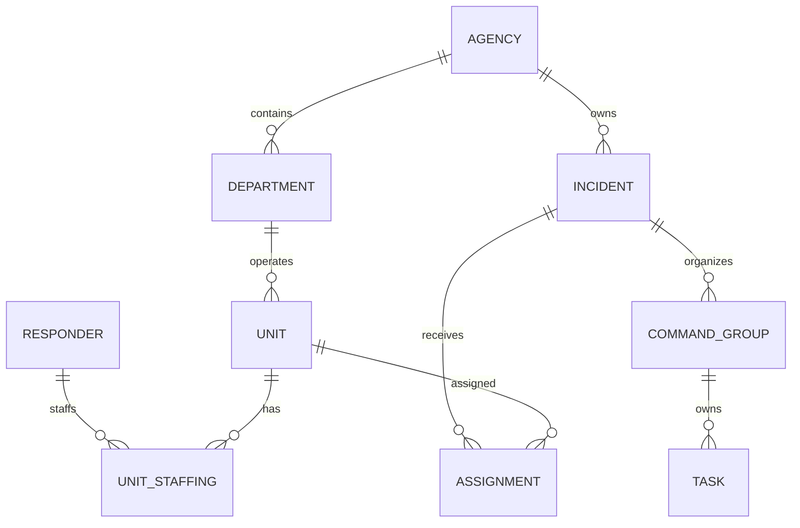

# Domain model

## Resource separation

Open911 does not treat a responder and a radio identifier such as “Officer 43” as the same object. Agencies may configure identifiers differently, so four concepts remain separate:

- **Responder:** a person who can authenticate, share location, hold qualifications, and receive assignments.
- **Unit:** an operational identifier or apparatus such as Engine 1, Medic 2, Car 12, or Officer 43.
- **Equipment:** a tracked resource or capability assigned to a station, unit, responder, or incident.
- **Unit staffing:** the time-bounded relationship between responders and a unit, including driver, officer, crew, or partner roles.

## Primary relationships

## Status model

The starter vocabulary is configurable per agency but maps to canonical categories:

| Canonical status | Typical labels |
| --- | --- |
| AVAILABLE | Available, In Quarters, In District |
| ASSIGNED | Assigned, Dispatched |
| RESPONDING | En Route, Responding |
| ON_SCENE | On Scene, Arrived |
| TRANSPORTING | Transporting, To Hospital |
| AT_DESTINATION | At Hospital, At Jail |
| CLEARING | Returning, Available Soon |
| OUT_OF_SERVICE | Out of Service, Unavailable |

Status changes always record subject, previous value, new value, actor, source device, location if authorized, timestamp, and optional incident.

## Incident lifecycle

`PENDING → DISPATCHED → ACTIVE → CONTROLLED → CLOSED`

Cancellation and reopening are explicit actions, not silent state rewrites. Notes are append-oriented with corrections attributed to an actor. Sensitive notes can be restricted to defined roles, but their creation and access remain auditable.

## Command organization

Every incident may begin with one command record and no groups. As it expands, command can add:

- Branches
- Divisions
- Groups
- Sectors
- Crews or teams
- Staging areas
- Tasks and objectives
- Radio channel assignments

Groups form a validated tree. Units and responders can have operational assignments without changing their agency ownership or permanent department.

## Messaging scopes

- Agency-wide announcements
- Department or configured paging groups
- Incident conversation
- Command group conversation
- Direct message

Emergency paging is modeled separately from ordinary chat so acknowledgement, retry, escalation, and delivery reporting can be added without changing message semantics.

